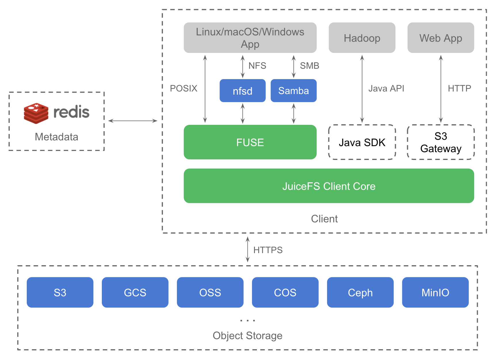

<p align="center"><a href="https://github.com/juicedata/juicefs"></a></p>
<p align="center">
    <a href="https://travis-ci.com/juicedata/juicefs"></a>
    <a href="https://goreportcard.com/report/github.com/juicedata/juicefs/pkg"></a>
    <a href="https://join.slack.com/t/juicefs/shared_invite/zt-kjbre7de-K8jeTMouDZE8nKEZVHLAMQ"></a>
</p>

**JuiceFS** is an open-sourced POSIX filesystem built on top of [Redis](https://redis.io) and object storage (e.g. Amazon S3), designed and optimized for cloud native environment. By using the widely adopted Redis and S3 as the persistent storage, JuiceFS serves as a stateless middleware to enable many applications to share data easily.

The highlighted features are:

- **Fully POSIX-compatible**: JuiceFS is a fully POSIX-compatible filesystem. Existing applications can work with it without any changes. See [pjdfstest result](#posix-compatibility) below.
- **Strong Consistency**: All confirmed changes made to your data will be reflected in different machines immediately.
- **Outstanding Performance**: The latency can be as low as a few microseconds and the throughput can be expanded to nearly unlimited. See [benchmark result](#performance) below.
- **Cloud Native**: By utilize cloud object storage, you could scaling storage and compute independently, a.k.a. disaggregated storage and compute architecture.
- **Sharing**: JuiceFS is a shared file storage can be read and write by many clients.
- **Global File Locks**: JuiceFS supports both BSD locks (flock) and POSIX record locks (fcntl).
- **Data Compression**: By default JuiceFS use [LZ4](https://lz4.github.io/lz4) to compress all your data, you could also use [Zstandard](https://facebook.github.io/zstd) instead.

---

[Architecture](#architecture) | [Getting Started](#getting-started) | [Benchmark](#benchmark) | [Supported Object Storage](#supported-object-storage) | [FAQ](#faq) | [Status](#status) | [Roadmap](#roadmap) | [Reporting Issues](#reporting-issues) | [Contributing](#contributing) | [Community](#community) | [Usage Tracking](#usage-tracking) | [License](#license) | [Credits](#credits)

---

## Architecture



JuiceFS rely on Redis to store filesystem metadata. Redis is a fast, open-source, in-memory key-value data store and very suitable for store the metadata.

## Getting Started

### Precompiled binaries

You can download precompiled binaries from [releases page](https://github.com/juicedata/juicefs/releases).

### Building from source

You need install [Go](https://golang.org) first, then run following commands:

```bash
$ git clone git@github.com:juicedata/juicefs.git
$ make
```

### Dependency

A Redis server (>= 2.2) is needed for metadata, please follow [Redis Quick Start](https://redis.io/topics/quickstart).

If you use macOS, you also need install FUSE for macOS 3.x. The latest version is [3.11.2](https://osxfuse.github.io/2020/10/05/OSXFUSE-3.11.2.html).

The last one you need is object storage. There are many options for object storage, local disk is the easiest one to getting started.

### Format

```bash
$ ./juicefs format test
```

### Mount

```bash
$ ./juicefs mount ~/jfs
```

## Benchmark

### POSIX-compatibility

### Performance

#### Throughput

Perform a performance benchmark comparison on JuiceFS, [EFS](https://aws.amazon.com/efs/), and [S3FS](https://github.com/s3fs-fuse/s3fs-fuse) by [fio](https://github.com/axboe/fio). Read [more details](benchmarks/fio.md).


## Supported Object Storage

- Amazon S3
- Google Cloud Storage
- Azure Blob Storage
- Alibaba Cloud Object Storage Service (OSS)
- Tencent Cloud Object Storage (COS)
- Ceph RGW
- MinIO
- Local disk
- Redis

For the detailed list, see [juicesync](https://github.com/juicedata/juicesync).

## FAQ

### Why doesn't JuiceFS support XXX object storage?

JuiceFS already supported many object storage, please check [the list](#supported-object-storage) first. If you couldn't found it, try [reporting issue](#reporting-issues) to the community.

### Can I use Redis cluster?

The simple answer is no. JuiceFS use [transaction](https://redis.io/topics/transactions) to guarantee the atomicity of metadata operations, which is not well supported in cluster mode.

## Status

It's considered as beta quality, the storage format is not stabilized yet. It's not recommended to deploy it into production environment. Please test it with your use cases and give us feedback.

## Roadmap

- Kubernetes CSI driver
- Stabilize storage format
- Hadoop SDK
- S3 gateway
- Windows client
- Encryption at rest
- Other databases for metadata


## Reporting Issues

We use [GitHub Issues](https://github.com/juicedata/juicefs/issues) to track community reported issues. You can also [contact](#community) the community for getting answers.

## Contributing

Thank you for your contribution! Please refer to the [CONTRIBUTING.md](CONTRIBUTING.md) for more information.


## Community

Welcome to join our [Slack channel](https://join.slack.com/t/juicefs/shared_invite/zt-kjbre7de-K8jeTMouDZE8nKEZVHLAMQ) to connect with JuiceFS team members and other users.

## Usage Tracking

JuiceFS by default collects **anonymous** usage data. It only collects core metrics (e.g. inode number), no user or any sensitive data will be collected. You could review related code [here](pkg/xxx.go).

These data helps [JuiceFS team](https://github.com/orgs/juicedata/people) to understand how the community is using this project. You could disable this feature easily, just follow steps below.

## License

JuiceFS is open-sourced under GNU AGPL v3.0, see [LICENSE](LICENSE).

## Credits

The design of JuiceFS was inspired by [Google File System](https://research.google/pubs/pub51), [HDFS](https://hadoop.apache.org) and [MooseFS](https://moosefs.com), thanks to their great work.
